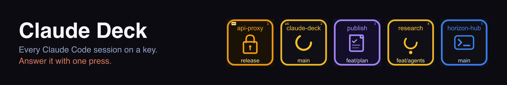

# Claude Deck

> **Every Claude Code session on a key — and answer its prompts with one press.**
> A live dashboard for the sessions you run in parallel, and the permission prompt,
> the plan and the question landing on the keys with the full command spelled out.

<!-- Badges: Row 1 — Identity -->
[](https://github.com/phmatray/claude-deck)
[](LICENSE)
[](#requirements)
[](#requirements)

<!-- Badges: Row 2 — Activity -->
[](https://github.com/phmatray/claude-deck/stargazers)
[](https://github.com/phmatray/claude-deck/commits)
[](https://github.com/phmatray/claude-deck/issues)

<!-- Badges: Row 3 — Quality -->
[](https://github.com/phmatray/claude-deck/actions/workflows/ci.yml)
[](https://www.conventionalcommits.org)

<!-- Badges: Row 4 — Distribution -->
[](https://github.com/phmatray/claude-deck/releases/latest)
[](https://github.com/phmatray/claude-deck/releases)

Claude Code on a Stream Deck XL, in two halves that ship as one thing:

- **Session dashboard** — one key per running `claude` session, colour = state. Press a key to bring that session's terminal to the front (the exact Warp pane, or the VS Code window). Plus plan-usage keys (5 h, week, per model) and a launcher key that opens a project in Warp with `claude` already running.
- **Answer keys** — Claude's multiple-choice questions and its permission prompts (**Autoriser** / **Toujours** / **Refuser**) go on the keys, the full command or question spelled out across two rows, one press answers.

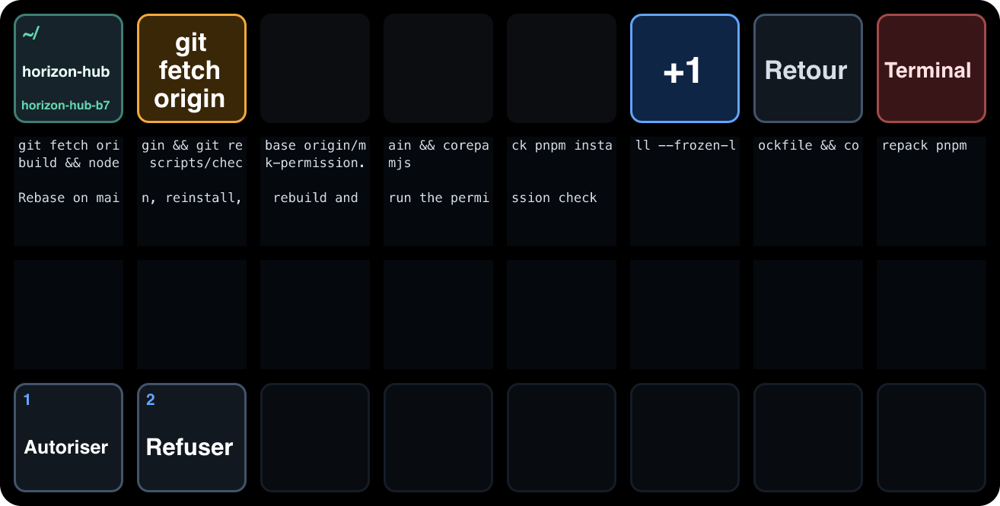

| Path | What |
|---|---|
| `claude-code/` | the Claude Code plugin `claude-deck`: status hooks, `claude-ask`, the `PermissionRequest` hook, the `ask-on-streamdeck` skill |
| `stream-deck/` | the Stream Deck plugin **Claude Deck** (`com.phmatray.claudedeck`): dashboard, usage keys, launcher, answer keys and their bundled profile |
| `.claude-plugin/marketplace.json` | the `phmatray` marketplace, pointing at `claude-code/` |
| `scripts/` | packaging, the two migrations, `check-*` self-checks, `probe-*` live probes |
| `docs/` | [architecture](docs/architecture.md), [development](docs/development.md), [Warp focus](docs/warp-focus.md) |

## Table of Contents

- [Why this exists](#why-this-exists)
- [State gallery](#state-gallery)
- [Requirements](#requirements)
- [Install](#install)
- [Upgrading from the two-plugin setup](#upgrading-from-the-two-plugin-setup)
- [How it works](#how-it-works)
- [Key reference](#key-reference)
- [Asking from the CLI](#asking-from-the-cli)
- [Limitations](#limitations)
- [Tech stack](#tech-stack)
- [Development](#development)
- [Roadmap](#roadmap)
- [Contributing](#contributing)
- [Acknowledgments](#acknowledgments)
- [License](#license)

## Why this exists

Five or nine `claude` sessions in as many Warp tabs, and the same two questions all day:
which one needs me, and where is it? Alt-tabbing through terminals to find the one showing
a prompt is the tax on running agents in parallel — and the prompt you finally find is a
yes/no you then answer by reaching back to the keyboard.

So: one key per session, coloured by state and sorted so whatever needs you is on the left.
Press it and that exact Warp pane comes forward. When Claude asks for permission, the whole
page becomes the prompt — the command spelled out across sixteen keys, **Autoriser** /
**Toujours** / **Refuser** underneath — and one press answers it. The terminal dialog stays
up the whole time; whichever you answer first wins, so the deck never traps you.

No daemon, no network, no telemetry. Two plugins, a few files in `~/.claude`, and hooks
Claude Code already fires.

## State gallery

| | State | Meaning |
|---|---|---|
| 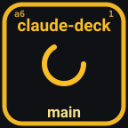 | `working` | Claude is generating / running tools |
| 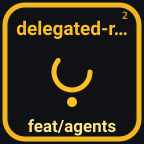 | `subagent` | Claude has delegated to a subagent (parent waiting) |
| 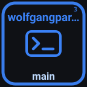 | `idle` | Claude is waiting for your next prompt |
| 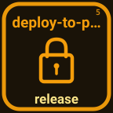 | `awaiting_permission` | A permission prompt is open — your turn |
|  | `awaiting_plan` | `ExitPlanMode` was called — plan approval pending |
| 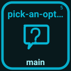 | `awaiting_question` | Claude is asking you to choose |
|  | `awaiting` | Some other prompt is waiting |
| 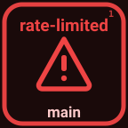 | `error` | Last turn failed (rate limit / auth / server error) |
| 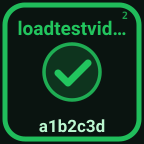 | `finished` | Session just ended (visible ~3 s, then drops) |
|  | `empty` | No session in this slot |

Background agents get their own muted variants: `bg_working`, `bg_idle`, `bg_awaiting`, `bg_awaiting_permission`.

## Requirements

- A Stream Deck XL (model `20GAT9901`), Stream Deck app 6.6 or newer, macOS 12 or newer.
- Claude Code, Node 20+, `jq`, `perl`.
- Optional: **Stream Deck** under *System Settings → Privacy & Security → Accessibility*. Only the cwd→Warp-tab fallback of the focus press needs it (it sends a keystroke); `warp://session/<uuid>` works without. Decline and that one fallback is skipped — see [Warp focus](docs/warp-focus.md).
- To build from source: [pnpm](https://pnpm.io) (`corepack pnpm` is enough).

## Install

### 1. The Stream Deck plugin

Download `com.phmatray.claudedeck.streamDeckPlugin` from the [latest release](https://github.com/phmatray/claude-deck/releases/latest) and double-click it. Or build it yourself:

```bash
git clone https://github.com/phmatray/claude-deck && cd claude-deck
scripts/package.sh
open dist/com.phmatray.claudedeck.streamDeckPlugin
```

**Install it this way even if you plan to hack on it.** The installer is the only thing that imports the bundled `Claude Deck` profile, and without that profile the plugin cannot switch your deck to the answer keys. Then place **Claude Session Slot** keys where you want them.

### 2. The Claude Code plugin

```bash
claude plugin marketplace add phmatray/claude-deck
claude plugin install claude-deck@phmatray
```

That installs the status hooks, the permission hook and the `ask-on-streamdeck` skill. `claude-ask` ships in the plugin's `bin/` (`claude-code/bin/claude-ask` here); it is not put on your `PATH`.

To pick up a later release:

```bash
claude plugin marketplace update phmatray && claude plugin update claude-deck@phmatray
```

Claude Code caches its own copy and only replaces it when the version changes, so nothing happens until there is a new release — and a session already running keeps the hooks it started with. Restart it.

### 3. Tell Claude to use it

Only needed for questions Claude asks on its own initiative — permission prompts and plans need nothing. Once per session, or put it in your `CLAUDE.md`:

> Ask me questions on the Stream Deck.

## Upgrading from the two-plugin setup

Before 3.0 this was two Stream Deck plugins (`com.julien.claudesessions` for the dashboard, `com.claudeask.streamdeck` for the answer keys) and a set of hook commands copied into `~/.claude/settings.json`. 3.0 is one Stream Deck plugin and one Claude Code plugin. Two scripts move you over; both back up before they touch anything and both take `--dry-run`. They live in the repository, so the steps below assume a checkout (`git clone https://github.com/phmatray/claude-deck && cd claude-deck`) — the release download alone does not bring them.

1. **Quit the Stream Deck app.** It rewrites its own profile files, and would overwrite the migration. `migrate-profiles.mjs` refuses to run on the app's folder while it is up.

2. **Re-point the keys you already placed**, so they keep their position and settings instead of turning into "missing plugin" tiles:

   ```bash
   node scripts/migrate-profiles.mjs --dry-run
   node scripts/migrate-profiles.mjs --remove-old-ask-profile
   ```

   It copies the whole profiles folder to `ProfilesV3.bak-<yyyymmdd>-claude-deck-v3` (never overwriting an existing backup), then rewrites every action that belonged to `com.julien.claudesessions` — multi-action children included — to `com.phmatray.claudedeck`. Keys of the old answer plugin are left alone; `--remove-old-ask-profile` moves its imported "Claude Ask" profile into the backup, since the new plugin brings its own.

3. **Remove the old plugins** from `~/Library/Application Support/com.elgato.StreamDeck/Plugins/`: `com.julien.claudesessions.sdPlugin` and `com.claudeask.streamdeck.sdPlugin` (in a dev setup the first is a symlink to an old checkout — delete the link, not the checkout). Then install the new `.streamDeckPlugin` as above.

4. **Update the Claude Code plugin**, so the hooks come from it rather than from your settings:

   ```bash
   claude plugin marketplace update phmatray
   claude plugin update claude-deck@phmatray
   ```

5. **Drop the old hook commands** from `~/.claude/settings.json` — left in place they log every event twice:

   ```bash
   node scripts/migrate-settings.mjs --dry-run
   node scripts/migrate-settings.mjs
   ```

   It backs the file up to `settings.json.bak.<yyyymmdd>-claude-deck-v3` and removes every hook command matching `(streamdeck-claude|claude-deck).*notification.(sh|ps1)`, dropping the matcher groups and event keys that leaves empty. Run it **after** step 4: it refuses to remove a hook for an event the installed plugin does not yet register itself, because those hooks would be the dashboard's only event feed until it does. `--force` overrides that.

The Setup key says whether it worked: an amber **HOOKS** badge means the plugin's hooks are not registered the way the dashboard needs. `sh scripts/probe-hooks.sh` prints the same verdict with the details.

## How it works

The dashboard reads `~/.claude/sessions/<id>.events.ndjson`, one line per hook call written by `claude-code/hooks/notification.sh`, and replays it through a small state machine. No daemon, no network.

The answer keys talk to Claude through one pair of files per question in `~/.claude-ask/`:

1. Claude (or the permission hook) runs `claude-ask` with a JSON question. It writes `questions/<id>.json` — with its session id — and waits.
2. The Stream Deck plugin sees the file, draws the keys, and switches your deck to its own profile. The session's dashboard key gets a small deck badge.
3. You press a key. The plugin writes `answers/<id>.json` and moves on to the next pending question, or switches the deck back.
4. `claude-ask` prints the answer, removes its two files and exits.

No lock: several sessions can ask at once, and their questions queue on the deck (oldest first). The queue key (`+N`) steps through them, **Retour** puts one aside (it stays pending on its session key; press that key to bring it back), **Terminal** hands it back to the terminal and brings that session's window forward. A dead `claude-ask` or an expired question drops off by itself.

## Key reference

### Dashboard keys

**Claude Session Slot** — one per session you want to see. Sessions are ordered "needs you first, then most recently active", so the keys always show the ones that matter; give the plugin more slots than you run sessions (see [`docs/architecture.md`](docs/architecture.md#slot-ordering)). The key shows the repo on top, the branch below, and a top-left badge for the `bg` tag or Claude Code's two-character session suffix — the only thing telling apart two sessions in the same worktree.

| Gesture | What happens |
|---|---|
| Short press | Brings that session's terminal to the front. If a question of its is waiting on the deck, it also comes up on the answer keys. |
| Hold ≥ 0.5 s | Wipes that session's event log and re-derives its state — the cure for an `awaiting` that got stuck. |
| Keep holding to 3 s | `SIGTERM` then `SIGKILL` for that session. A red ring fills while it arms; let go before it closes to cancel. Background agents share a daemon pid and are never killed. |

**Claude Setup** — wipes every event log and re-renders. Also self-checks the hook install and shows an amber **HOOKS** badge when something is off.

**Claude Usage: Session (5 h) / Week (all models) / Week (per model)** — the plan's rate-limit windows, read from the snapshot Claude Code caches in `~/.claude.json`: no credentials, no network call. Colour steps green → amber → orange → red. The footer says `limite atteinte` at 100 %, otherwise `limite ~HH:MM` (`limite ~jeu 14:30` on the weekly key) — a stateless projection of when the burn rate so far runs you out — and falls back to the countdown to the reset when there is nothing to project. Claude Code only refetches that snapshot when something asks to *see* usage, which a GUI-hosted session never does, so the plugin refreshes it itself by running `claude -p "/usage"` every 5½ minutes while a usage key is on the deck. Pressing any of them forces a refresh past that throttle; the key answers with a tick or an alert, since a refresh often legitimately cannot move the number.

**Claude Launcher** — opens a project in Warp with `claude` already running. Set `directory` (absolute, or `~/…`), and optionally a `label`, a `command` (default `claude`) and `newWindow`, in the key's property inspector. The key writes `~/.warp/tab_configs/claude_deck_<slug>.toml` and presses open `warp://tab_config/claude_deck_<slug>`. An unconfigured key reads **Dossier ?**.

### Answer keys

The bundled `Claude Deck` profile, 8 × 4:

|  | 0 | 1 | 2 | 3 | 4 | 5 | 6 | 7 |
|---|---|---|---|---|---|---|---|---|
| **row 0** | context | header | — | — | — | queue | back | Terminal |
| **row 1** | detail 1 | detail 2 | detail 3 | detail 4 | detail 5 | detail 6 | detail 7 | detail 8 |
| **row 2** | detail 9 | detail 10 | detail 11 | detail 12 | detail 13 | detail 14 | detail 15 | detail 16 |
| **row 3** | option 1 | option 2 | option 3 | option 4 | option 5 | option 6 | option 7 | option 8 |

The sixteen detail keys are one text surface: the text is wrapped at the width of a whole row (104 columns, 13 per key) and each key shows its own columns, so words run on from key to key. Two rows of six lines each; longer text ends in `…`. The header key's colour tells the kind: amber for a permission prompt, violet for a plan, blue for a question. The context key shows the project, and the session's name when the dashboard knows it. Unused option keys go dark.

A plan waiting for approval:

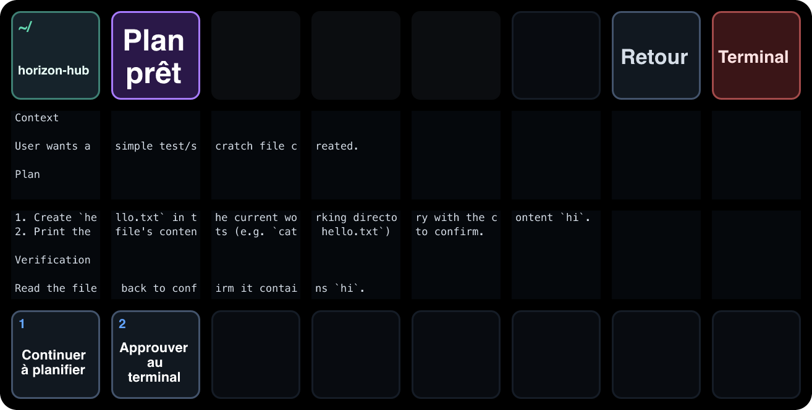

### Permission prompts

The Claude Code plugin registers a `PermissionRequest` hook (`claude-code/hooks/hooks.json` → `claude-code/bin/claude-permission`). When Claude Code asks to use a tool, the deck shows **Autoriser** / **Refuser** — plus **Toujours** when Claude Code suggested a rule to remember — with the tool on the header key, the call itself across the detail keys (a Bash command and its description, a file path with the first line of an edit, a URL, an MCP tool's input) and the project on the context key.

The terminal dialog stays up meanwhile: whichever you answer first wins, and answering in the terminal withdraws the deck question (detected through the session event log, when the hooks are installed). Read the detail keys before pressing, not just the header — three words can't tell `git push` from `git push --force`. When the detail ends in `…`, the rest is in the terminal.

**Toujours** stores Claude Code's own suggested rule — not the broader one the terminal offers — spelled out on the last detail line, `Toujours = Bash(python3 …) · localSettings`, so it is never a blind press. It only appears when the prompt carries such a suggestion.

A plan is the exception. A hook cannot approve `ExitPlanMode`: a `{"behavior":"allow"}` decision leaves the dialog standing, while a deny does get through. So a plan shows **Continuer à planifier** — which denies with a message asking Claude what to change, and it revises — and **Approuver au terminal**, which answers nothing and just brings the terminal forward for you to hit Enter.

## Asking from the CLI

Claude does this for you through the `ask-on-streamdeck` skill, but the CLI is plain enough to use directly:

```bash
cat <<'JSON' | claude-code/bin/claude-ask
{
  "header": "Approach",
  "question": "Retries time out under load. Which fix?",
  "timeout": 180,
  "options": [
    {"label": "Add jitter", "description": "Smallest change. Fixes the retry pile-up."},
    {"label": "Token bucket", "description": "Fairer, but adds state to maintain."},
    {"label": "Leave it", "description": "Not worth the churn right now."}
  ]
}
JSON
```

Prints `{"index":0,"optionId":"0","label":"Add jitter","cancelled":false}`.

| Field | Meaning |
|---|---|
| `question` | Full text. Printed in the terminal, and on the detail keys followed by the numbered options. |
| `header` | 1-3 words. This is what the header key shows. |
| `options` | 1-8 items. `label` on the key, `description` in the terminal and on the detail keys, optional `id` (default: the index) returned as `optionId`; `"terminal"` is reserved (acts as the Terminal key, exit 2). |
| `detail` | Optional. What the detail keys show instead of the question and its options. |
| `timeout` | Seconds, default 180. |
| `context` | Top-left key. Defaults to the current directory's name. |

The session is found by walking up the process tree to the `claude` process (`--session <id>` overrides it).

| Exit | Meaning |
|---|---|
| 0 | Answered. |
| 1 | Bad input. |
| 2 | You pressed "Terminal". |
| 3 | Timed out, or withdrawn (killed). |

There is no exit 4 any more: a second question queues instead of being refused.

Anything other than 0 means *ask in the terminal instead* — never assume an answer.

### Writing labels that fit

A key is 72px. Labels are measured against real font metrics and auto-sized between 18px and 48px, wrapping onto up to three lines, but the honest ceiling is two or three short words.

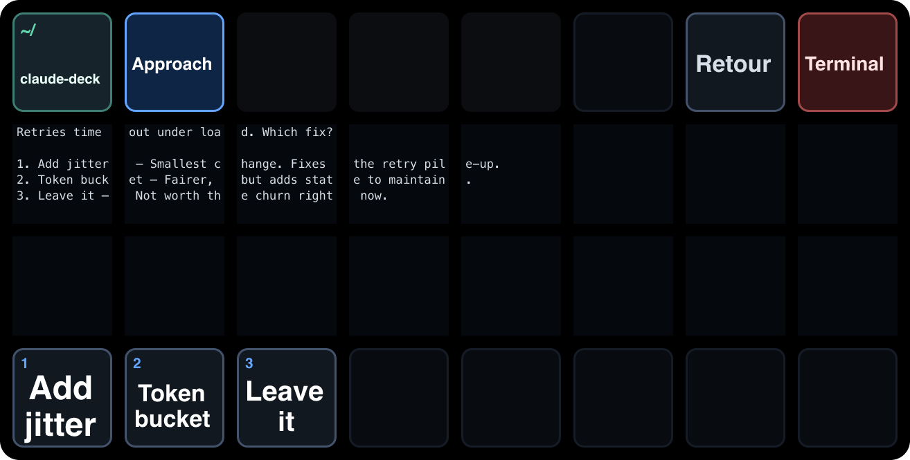

Put the reasoning in `description`. You read that on the detail keys (and in the terminal) while deciding; the key is just the button you press.

Do not put what the choice hinges on in a label — three words cannot distinguish `git push` from `git push --force origin main`. It belongs in the question or its descriptions, where the detail keys show it; if it is longer than two rows of them, ask in the terminal.

## Limitations

- **Stream Deck XL only.** The bundled profile is built for the 8 × 4 XL (`DEVICE_MODEL` in `stream-deck/scripts/build-profile.mjs`, `DeviceType` in the manifest). Other sizes would need their own profile and their own detail layout.
- **macOS only**, by design and not just by testing: focusing a terminal goes through `open` and `osascript`, the paths are `~/Library/…`, and the usage refresher works around launchd's `PATH`.
- **A plan cannot be approved from the deck.** A `PermissionRequest` hook's `allow` does not dismiss the `ExitPlanMode` dialog (a deny does), so the plan keys are "keep planning" and "approve in the terminal".
- **Claude's own `AskUserQuestion` never reaches the deck.** The permission hook skips it deliberately — the dialog it opens cannot be answered from a hook. Questions get on the keys when Claude calls `claude-ask`, which is what the `ask-on-streamdeck` skill is for.
- **Nothing shows with `--dangerously-skip-permissions`.** That mode never asks, so there is no prompt to put on the keys.
- **Eight options max.** That is how many option keys the page has.
- **One question on the keys at a time.** Others queue behind it; the queue key shows how many.

### Stuck deck

A question whose `claude-ask` died without cleaning up disappears from the deck on its own (the plugin checks the process). To clear every pending question by hand:

```bash
rm -f ~/.claude-ask/questions/*.json
```

A deck left on "Claude Deck" with nothing pending (the plugin restarted meanwhile): press **Retour**.

### Slow page switches

```bash
sh scripts/probe-deck-link.sh
```

Forces one page switch and reads the Stream Deck log. RED means the deck's control channel is desynced (every command times out after 5 s, often after the Mac wakes up): unplug the deck for 15 s and plug it back in.

## Tech stack

| | |
|---|---|
| **Stream Deck plugin** | TypeScript (ESM, `strict`), the [`@elgato/streamdeck`](https://github.com/elgatosf/streamdeck) Node SDK, bundled to one file by Rollup. Every key is an SVG drawn at render time and pushed as a data URL — no bitmap assets, no fonts shipped. |
| **Claude Code plugin** | POSIX shell (`jq`) for the hooks, Node for `claude-ask` and `claude-permission`, `hooks/hooks.json` for the wiring. Zero runtime dependencies. |
| **Between them** | Two file protocols: append-only NDJSON event logs in `~/.claude/sessions/`, and one question/answer pair per prompt in `~/.claude-ask/`. No daemon, no socket, no network. |
| **Build & release** | `corepack pnpm`, `@elgato/cli` for validate and pack, `@resvg/resvg-js` to rasterize the README art from the plugin's own key code. GitHub Actions runs every `check-*` on push and attaches the `.streamDeckPlugin` to a `v*` tag. |
| **Tests** | No framework: hermetic `node:assert` scripts, one per piece of logic, each runnable on its own. |

## Development

```bash
scripts/package.sh                    # build dist/com.phmatray.claudedeck.streamDeckPlugin
stream-deck/scripts/link-plugin.sh    # after one real install: run the repo build directly
node scripts/check-permission.mjs     # one of the self-checks; no deck needed
```

With the link in place, `corepack pnpm build && corepack pnpm sd:reload` in `stream-deck/` restarts the plugin on the new code. Changes to the **key layout** mean rebuilding the profile and reinstalling the `.streamDeckPlugin`, because only the installer imports profiles.

Every `check-*` script is hermetic (temp `HOME`, temp `CLAUDE_ASK_DIR`) and runs in CI; every `probe-*` script needs the real deck or the real `~/.claude` and is for a human at the hardware. [`docs/development.md`](docs/development.md) has the full list, the verification checklist, the Stream Deck SDK notes and how a release is cut.

## Roadmap

Tracked in the [open issues](https://github.com/phmatray/claude-deck/issues). The themes:

- **Other deck sizes.** The bundled profile is XL-only; a 5 × 3 needs its own layout and a
  narrower detail strip — see [Limitations](#limitations).
- **Tuning the detail strip on hardware.** Its font size, column count and line height are
  first guesses that have had one look at a real deck. Issues with a photo are welcome.
- **A plan that can be approved from the deck.** Blocked upstream: a `PermissionRequest`
  hook's `allow` does not dismiss the `ExitPlanMode` dialog.
- **Questions without the skill.** Same shape: `AskUserQuestion` cannot be answered from a
  hook, so Claude has to call `claude-ask` for a question to reach the keys.

## Contributing

Issues and pull requests are welcome — including "this key is unreadable on my deck",
which is the kind of thing only hardware in someone else's hands can tell me. Start with
[`CONTRIBUTING.md`](CONTRIBUTING.md) for the setup, the `check-*` convention and the
commit rules, and [`CLAUDE.md`](CLAUDE.md) for the architecture tour.

## Acknowledgments

Two MIT projects, merged here with their history intact:

- [streamdeck-claude](https://github.com/k-ibaraki/streamdeck-claude) — the session dashboard. Started by **Julien Cruau**, with later work by **Keita Ibaraki**.
- [streamdeck-claude-answer](https://github.com/hardkoded/streamdeck-claude-answer) — the answer keys, by **Darío Kondratiuk**.

Added on top: the exact-Warp-pane focus, animation only for the states that need you (so page switches stay fast), the XL profile and its 16-key detail strip, the permission and plan keys, the per-session question queue, the burn-rate projection on the usage keys, and the launcher.

## License

[MIT](LICENSE) © 2026 [Philippe Matray](https://github.com/phmatray) — the file keeps all
three copyright lines, this project's and the two it builds on.

---

If Claude Deck saves you an alt-tab, a ⭐ helps other people running agents in parallel find it.

