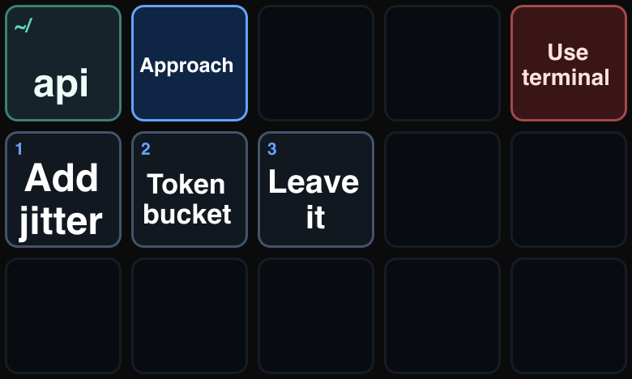
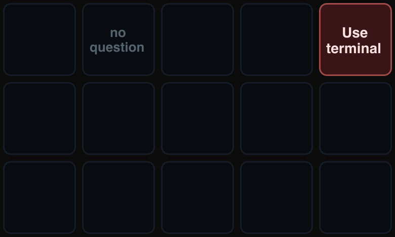
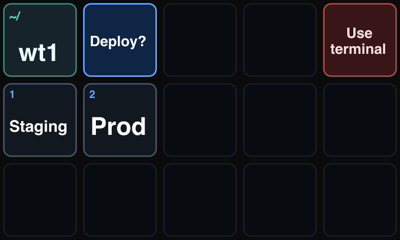

# Claude Deck

Claude Code on a Stream Deck XL, in two halves:

- **Session dashboard**: one key per running `claude` session, colour = state. Press a key to bring that session's terminal to the front (the exact Warp pane, or VS Code). Plus plan usage keys (5 h, week, per model).
- **Answer keys** (the rest): Claude's multiple-choice questions and its permission prompts (**Autoriser** / **Refuser**) go on the keys, one press answers.



Built from two MIT projects, history kept: [k-ibaraki/streamdeck-claude](https://github.com/k-ibaraki/streamdeck-claude) by Julien Cruau became the dashboard, and [hardkoded/streamdeck-claude-answer](https://github.com/hardkoded/streamdeck-claude-answer) by Dario Kondratiuk became the answer keys. Added on top: focus on the exact Warp pane, animation only for states that need you (page switches stay fast), the XL profile, the permission keys.

| Path | What |
|---|---|
| `claude-code/` | Claude Code plugin `claude-deck`: the status hooks, `claude-ask`, the `PermissionRequest` hook, the ask-on-streamdeck skill |
| `stream-deck/` | Stream Deck plugin **Claude Deck** (`com.phmatray.claudedeck`): dashboard, usage keys, answer keys and their profile. See [stream-deck/README.md](stream-deck/README.md) |
| `.claude-plugin/marketplace.json` | the `phmatray` marketplace, pointing at `claude-code/` |

## How it works

The dashboard reads `~/.claude/sessions/<id>.events.ndjson`, one line per hook call written by `claude-code/hooks/notification.sh`.

The answer keys talk to Claude through two files in `~/.claude-ask/`:

1. Claude runs `claude-ask` with a JSON question. It writes `question.json` and waits.
2. The Stream Deck plugin sees the file, draws the keys, and switches your deck to its own profile.
3. You press a key. The plugin writes `answer.json` and switches the deck back.
4. `claude-ask` prints the answer and exits.

No network, no daemon, no polling service. Two files and a file watcher.

## Requirements

- A Stream Deck XL (model `20GAT9901`), Stream Deck app 6.6 or newer, macOS 12+.
- Claude Code, Node 20+, `jq`, pnpm (`corepack pnpm` works).

## Install

### 1. The Stream Deck plugin

```bash
scripts/package.sh
open dist/com.phmatray.claudedeck.streamDeckPlugin
```

**Install it this way even if you plan to hack on it.** The installer is the only thing that imports the bundled `Claude Deck` profile, and without that profile the plugin cannot switch your deck. Then place **Claude Session Slot** keys where you want them.

### 2. The Claude Code plugin

```bash
claude plugin marketplace add /path/to/claude-deck
claude plugin install claude-deck@phmatray
```

That installs the status hooks, the permission hook and the `ask-on-streamdeck` skill. `claude-ask` ships in the plugin's `bin/` (`claude-code/bin/claude-ask` here); it is not put on your PATH. Claude Code only refreshes its installed copy when the version changes: bump `version` in `.claude-plugin/marketplace.json` and `claude-code/.claude-plugin/plugin.json`, then `claude plugin marketplace update phmatray && claude plugin update claude-deck@phmatray`.

### 3. Tell Claude to use it

Once per session, or put it in your `CLAUDE.md`:

> Ask me questions on the Stream Deck.

## Usage

Claude does this for you, but the CLI is plain enough to use directly:

```bash
cat <<'JSON' | claude-code/bin/claude-ask
{
  "header": "Approach",
  "question": "Retries time out under load. Which fix?",
  "timeout": 180,
  "options": [
    {"label": "Add jitter", "description": "Smallest change. Fixes the retry pile-up."},
    {"label": "Token bucket", "description": "Fairer, but adds state to maintain."},
    {"label": "Leave it", "description": "Not worth the churn right now."}
  ]
}
JSON
```

Prints `{"index":0,"label":"Add jitter","cancelled":false}`.

| Field | Meaning |
|---|---|
| `question` | Full text. Goes to the terminal, not the keys. |
| `header` | 1-3 words. This is what the question key shows. |
| `options` | 1-10 items. `label` on the key, `description` in the terminal. |
| `timeout` | Seconds, default 180. |
| `context` | Top-left key. Defaults to the current directory's name. |

| Exit | Meaning |
|---|---|
| 0 | Answered. |
| 2 | You pressed "Use terminal". |
| 3 | Timed out. |
| 4 | Another question already owns the deck. |

Anything other than 0 means *ask in the terminal instead* — never assume an answer.

### Key layout

|  | 0 | 1 | 2 | 3 | 4 |
|---|---|---|---|---|---|
| **row 0** | context | question | — | — | Use terminal |
| **row 1** | option 1 | option 2 | option 3 | option 4 | option 5 |
| **row 2** | option 6 | option 7 | option 8 | option 9 | option 10 |

Unused option keys go dark. With no question pending the whole page is idle:



### Permission prompts

The plugin also registers a `PermissionRequest` hook (`claude-code/hooks/hooks.json` → `claude-code/bin/claude-permission`). When Claude Code asks to use a tool, the deck shows **Autoriser** / **Refuser**, with the command's first words on the question key and the project on the context key. The terminal dialog stays up meanwhile: whichever you answer first wins, and answering in the terminal withdraws the deck question (detected through the dashboard's session event log, when its hooks are installed). Read the full command in the terminal before pressing — three words on a key can't tell `git push` from `git push --force`.

Nothing shows with `--dangerously-skip-permissions`, which never asks. There is no "always allow" key, and a prompt that arrives while another question holds the deck stays terminal-only.

### Stuck deck

If a session is killed hard enough to skip its cleanup, the deck can stay on the ask profile. This releases it:

```bash
rm -f ~/.claude-ask/question.json
```

### Slow page switches

```bash
sh scripts/probe-deck-link.sh
```

Forces one page switch and reads the Stream Deck log. RED means the deck's control channel is desynced (every command times out after 5 s, often after the Mac wakes up): unplug the deck for 15 s and plug it back in.

## Writing good labels

A key is 72px. Labels are measured against real font metrics and auto-sized between 18px and 48px, wrapping onto up to three lines, but the honest ceiling is two or three short words.



Put the reasoning in `description`. You read that in the terminal while deciding; the key is just the button you press.

Do not use the deck for choices where exact wording matters — approving a specific shell command, confirming a destructive action. Three words cannot distinguish `git push` from `git push --force origin main`. Ask in the terminal for those.

## Configuring the Elgato MCP server in Stream Deck

Separate from this plugin, Stream Deck can expose itself to an AI assistant over MCP. It is worth setting up, and it is worth knowing what it does *not* do.

**Enable MCP in the Stream Deck app.** In Stream Deck 7.5's settings, turn on the MCP/AI feature. It adds a virtual **MCP Deck** device (8x4) alongside your hardware. You can confirm it stuck:

```bash
defaults read com.elgato.StreamDeck MCP_enabled   # 1 when enabled
```

**Add the server to Claude Code.** Elgato ships it on npm as [`@elgato/mcp-server`](https://www.npmjs.com/package/@elgato/mcp-server):

```bash
claude mcp add elgato --scope user -- npx --yes @elgato/mcp-server@latest
```

Or by hand in `~/.claude.json`:

```json
{
  "mcpServers": {
    "elgato": {
      "type": "stdio",
      "command": "npx",
      "args": ["--yes", "@elgato/mcp-server@latest"],
      "env": {}
    }
  }
}
```

Restart Claude Code and ask it to check `bridge_status`. It should report `Connected Elgato apps: streamdeck`. If the tools are missing, the Stream Deck app is not running or MCP is off.

**What you get.** Five tools: `bridge_status`, `streamdeck__list_actions`, `streamdeck__get_context`, `streamdeck__get_executable_actions`, `streamdeck__invoke_plugin_method`.

**Why this project does not use it.** The MCP server can enumerate the actions your installed plugins provide and call methods on plugins that opt in by publishing an AI schema. It cannot create a page, place a key, draw a key, or tell you that a key was pressed. `get_executable_actions` returns an empty list unless an installed plugin is explicitly AI-ready. So MCP is a fine way to let Claude *inspect* your Stream Deck setup, and no way to build an input device out of it — which is why the question flow here is a real Stream Deck plugin rather than a few MCP calls.

## Development

```bash
scripts/package.sh        # build dist/com.phmatray.claudedeck.streamDeckPlugin
stream-deck/scripts/link-plugin.sh   # after one real install: run the repo build directly
node scripts/check-permission.mjs   # permission hook self-check, no deck needed
```

With the link in place, `corepack pnpm build && corepack pnpm sd:reload` in `stream-deck/` restarts the plugin on the new code. Changes to the **key layout** mean rebuilding the profile and reinstalling the `.streamDeckPlugin`, because only the installer imports profiles.

```
.claude-plugin/         marketplace manifest
claude-code/            Claude Code plugin: hooks, bin/claude-ask, bin/claude-permission, skills/
stream-deck/            the Stream Deck plugin (own README and scripts)
scripts/                packaging, migrations, check-* self-checks, probe-* live probes
docs/                   dashboard reference notes + rendered key art for this README
```

`stream-deck/scripts/build-profile.mjs` generates the bundled profile. Its comments document the four things that make Stream Deck's profile importer fail silently — worth reading before you touch it, since it accepts a broken profile without an error and hands you a page with no keys.

### About the images

The images in this README are rendered from the plugin's own SVG key art with `rsvg-convert`, not photographed off the hardware. They are accurate about layout, sizing, and colour. Be aware that Stream Deck's renderer is stricter than `rsvg`: it honours neither per-`tspan` positioning nor `text-anchor`, which is why the renderer emits one `<text>` element per line with an explicit `x`.

## Limitations

- **Stream Deck XL only.** The bundled profile targets model `20GAT9901` (`DEVICE_MODEL` in `stream-deck/scripts/build-profile.mjs`, `DeviceType` in the manifest). Other sizes need their own profile.
- **Ten options max.** That is how many option keys the page has.
- **One question at a time.** A lock file means a second question gets exit code 4 rather than stealing the deck.
- **macOS only**, because that is all this has been tested on. Nothing in it is deeply mac-specific except the paths.

## License

MIT
